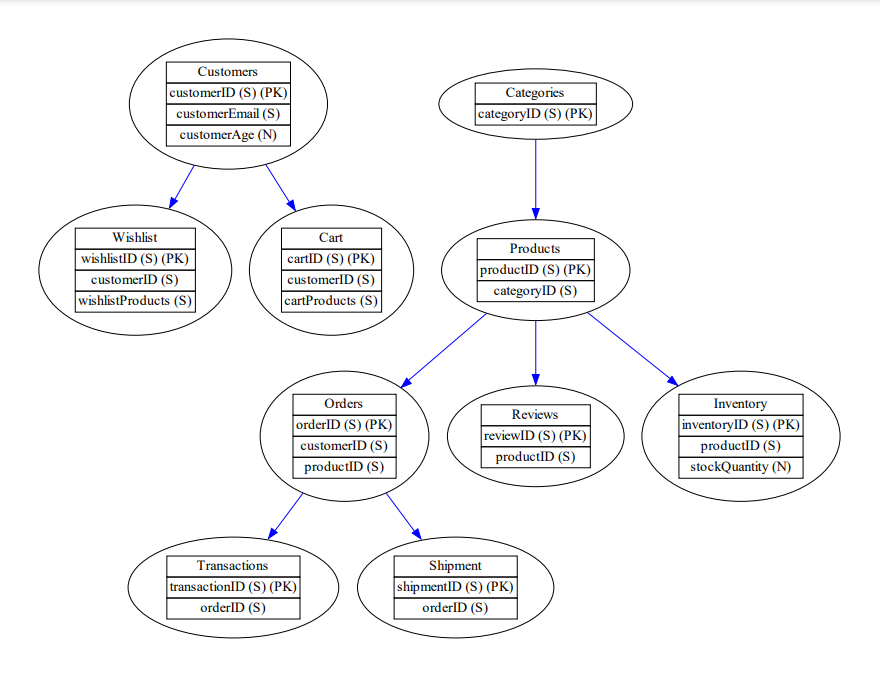

# DynamoDB Visualizer

[DynamoGrafter GitHub](https://github.com/keturk/DynamoGrafter.git)

This project is a collection of Python scripts designed to help you visualize and understand the structure of your DynamoDB tables and their relationships using the Graphviz library. The project consists of three main scripts:

1. [yaml_parser.py](yaml_parser.py): A Python script for parsing YAML files containing configuration data. This script is responsible for extracting information about DynamoDB tables, their primary keys, attributes, and indexes.

2. [graph_generator.py](graph_generator.py): This script takes the parsed YAML data and generates graphical representations of DynamoDB tables. It uses Graphviz to create visual diagrams that illustrate the tables and their attributes.

3. [dynamo_grafter.py](dynamo_grafter.py): A script that builds on the functionality of the `graph_generator.py` script. It not only generates diagrams but also shows the relationships between tables, highlighting primary key and index connections.

## Table of Contents
- [Description](#description)
- [Installation](#installation)
- [Usage](#usage)
- [License](#license)

## Description

DynamoDB is a versatile NoSQL database service, but understanding the structure of your tables and their relationships can be challenging. This project aims to simplify the process by providing visualization tools for DynamoDB configurations stored in YAML format.

## Installation

To get started with this project, follow these installation instructions:

1. Clone the repository to your local machine:

```bash
git clone https://github.com/your-username/your-repo-name.git
```

2. Install the necessary Python dependencies for the scripts using `pip`:

```bash
pip install -r requirements.txt
```

Thank you for providing additional details. Here's the revised "Usage" section that includes the ability to specify an output path and describes how the output file name is generated:

## Usage

To utilize this project, you primarily interact with the `dynamo_grafter.py` script, which orchestrates the functionality of the other two scripts (`yaml_parser.py` and `graph_generator.py`). Here's how to use the project:

### 1. `dynamo_grafter.py`

This script is the entry point for generating visualizations of your DynamoDB tables and their relationships. It calls the `yaml_parser.py` to parse the YAML configuration and `graph_generator.py` to create graphical representations.

Example usage:

```bash
python dynamo_grafter.py dynamodb_test.yaml [output_path]
```

- `dynamodb_test.yaml`: Replace with the path to your YAML configuration file.
- `[output_path]` (optional): Specify an output directory path. If not provided, the output file will be created in the current working directory.

The output file will be named based on the input file's name, with the extension changed to `.graph`. For example, if your input file is named `dynamodb_test.yaml`, the output file will be `dynamodb_test.graph`.

### YAML Configuration File

To effectively use this tool, ensure that your YAML configuration file adheres to a specific format, providing details about your DynamoDB tables, including their primary keys and indexes. Below is an illustrative example:

[dynamodb_test.yaml](dynamodb_test.yaml)

When you run the script, it will analyze the configuration file, generating a comprehensive graph that visually represents the tables and their interconnected relationships.


## License

This project is licensed under the MIT License - see the [LICENSE](LICENSE) file for details.

---

© 2023 Kamil Ercan Turkarslan
